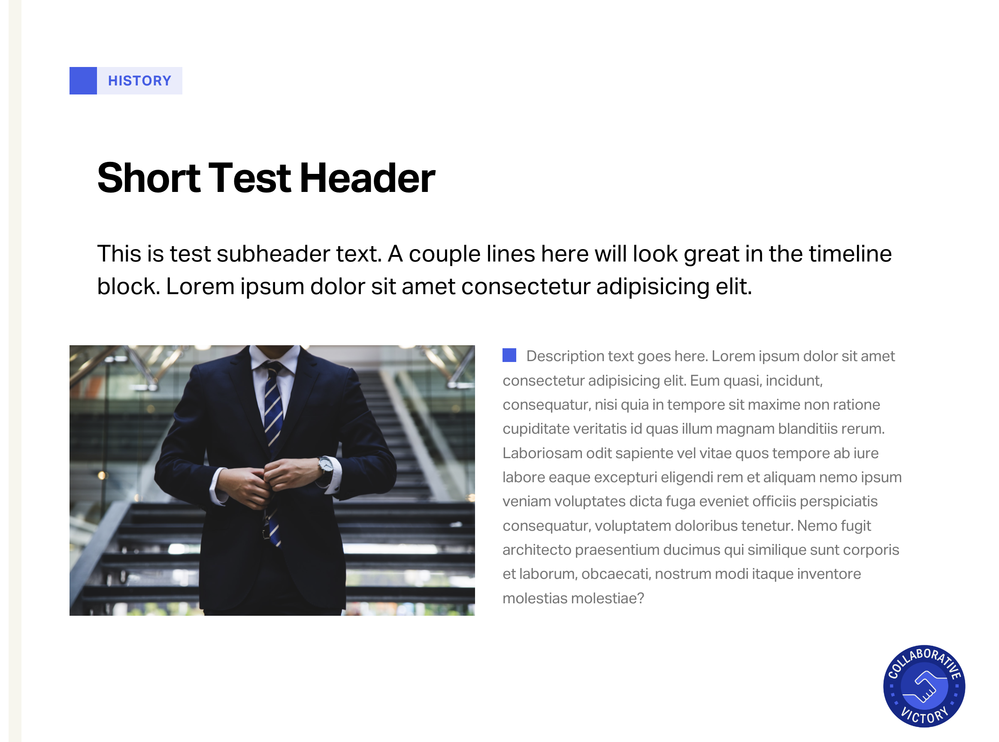
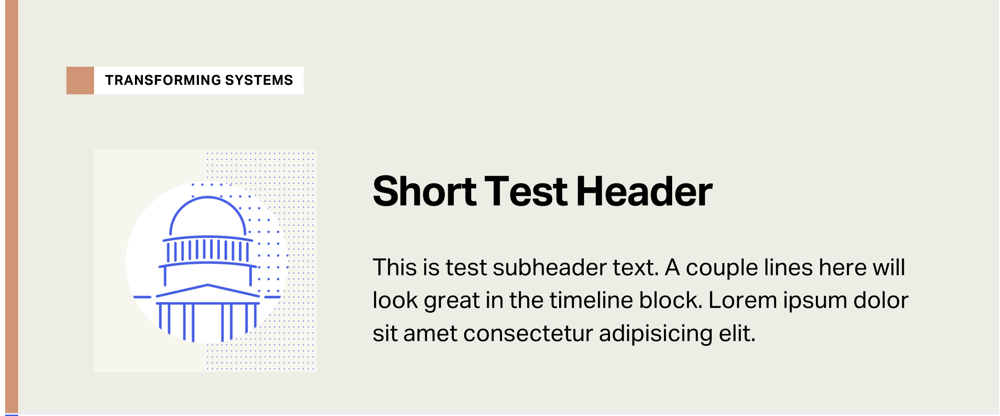
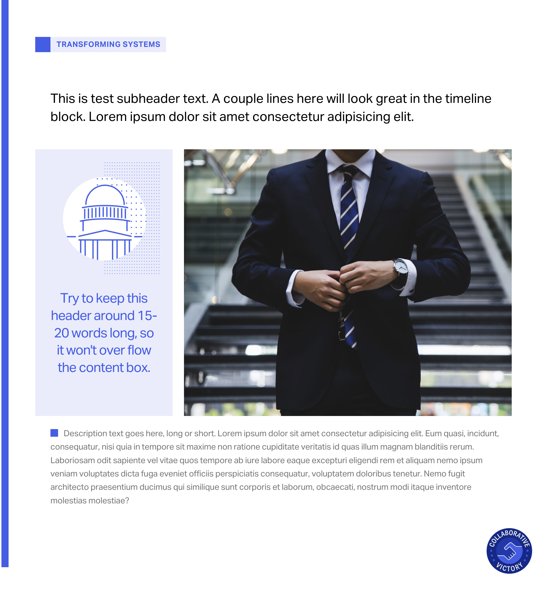

# History of the Innocence Project

## Adding Content

Video demo: [https://www.loom.com/share/8eba7d25fe364c048e3c8b55338b3065](https://www.loom.com/share/8eba7d25fe364c048e3c8b55338b3065)

#### Summary:
- **If new content contains an image:**
    - navigate to `/web/assets/images/timeline`
    - click `Add files`, then `Upload files`
    - drag and drop your image file to upload
    - click `Commit`
- **Choose template for new timeline block**
    - templates are found in the `/new-content-templates` folder
    - hit 'Copy Raw Text' button to copy template in clipboard
    - create folder and file in the `/web/_timeline` folder for relevant year
    - paste in template, fill out relevant data
    - click `Commit`
    - write summary of commit (ex. 'Added content for 2023.') 
    - Done. Website should update within a few minutes.
- **If you need to go back or delete**
    - delete folder if only 1 entry
        - navigate to folder
        - in upper right hand area, click 'Delete Folder' button
        - if asked, provide brief commit summary
    - if there are multiple time blocks but you only need to delete 1,
        - navigate to specific year and template file of corresponding timeblock
        - upper right hand area, click the trash can icon to delete file
        - if asked, provide brief commit summary

*Example to add content for the year 2023:*
- navigate to `web` folder above, then `templates` folder
- choose template, click `Raw Text`, copy text
- go back, then navigate to `_timeline` folder
- click **Add file** 
- type in `2023` (slash) `1-custome-file-name.md` 
- paste template text
- fill out relevant data in template
- click `Commit`
- Done! 👏

## New Content Layouts

There are three different layouts to add new timeline blocks. The first layout (Standard) is the most flexible, with most content fields being optional.

### Standard Layout `/new-content-templates/standard.md`:



### Icon Layout `/new-content-templates/icon.md`:



### Icon and Image Layout `/new-content-templates/icon-and-image.md`:



## Developers
---

### To develop using Docker Compose locally:
```
docker compose build               # Build the custom Docker container.
docker compose up -d               # Start it.
docker compose exec web /bin/bash  # Enter the container (by default at /var/www)

# When you enter the container it will automatically install jekyll and dependencies, but not build the site. 

# Build the site using jekyll, rebuilding automatically when changes are made.
bundle exec jekyll build --watch # Add -V (verbose) for more information how long each build step is taking
```

### Checking a build from GitHub locally:

When pushing to the [develop](https://github.com/ten7/history.innocenceproject.org/tree/develop) branch the [CI](.github/workflows/deployment.yml) builds the site on GitHub using the same process that is used for the live site. But instead of the site being deployed to live, it pushes the resultant build (build artifacts) to the [gh-pages-develop](https://github.com/ten7/history.innocenceproject.org/tree/gh-pages-develop) branch on GitHub. 
Steps to check the build:
  1. Download the [zip of that branch](https://github.com/ten7/history.innocenceproject.org/archive/refs/heads/gh-pages-develop.zip) and unzip to the "site"
  2. Unzip the files inside the folder inside to the `site` folder.
    - The site build is in <zip file>/<folder that doesn't matter>/<here>
  3. Start the docker container.
  4. Do _not_ enter the container or run `bundle exec jekyll build`
  5. Instead go to `history.innocenceproject.test` to see the built site.
  
### Notes: 
- Prefix all `jekyll` commands with `bundle exec` to run them in `/var/www/src` inside the container. 
- Any changes made to _config.yml won't be detected by `jekyll build --watch`
 - You must Control/Command-C the jekyll process and restart it manually to update changes to that file.
 - Files are built to /var/www/web inside the container. 
   - This is the `site` folder outside the container.

### Next steps:
See the [jekyll](https://jekyllrb.com/docs/) documentation for info on Jekyll.

---
### Repository setup:
```
. (This folder)       
├── assets            |Site fonts, JS scripts, and images
├── db-backups        |Unused  (here if needed)
├── scripts           |Scripts (if needed)        
├── site              |Site build directory [/var/www/web]
├── web               |Jekyll source dir [/var/www/src]
│   ├── collections   |Collections dir (like posts)
│   ├── _data         |Additional data that can be used by Jekyll (is reloaded live)
│   ├── _includes     |Snippets "partials" of code that can be included in layouts and posts.
│   ├── _layouts      |Templates that wrap posts and pages.
│   ├── pages         |Pages (note: each has a permalink to prevent urls being <url>/pages/page)
│   ├── _plugins      |Optional folder for plugins
│   ├── _config.yml   |Configuration file for Jekyll
│   ├── Gemfile       |Basically composer.json, but for Ruby
│   └── Gemfile.lock  |composer.lock, but for Ruby
│                     |
├── docker-compose.yml|Settings for docker compose
├── Dockerfile        |Definitions for the custom container.
├── flight-deck.yml   |Settings for Apache & the container
└── README.md         |This file
```

```
  7777777777777777777777777777777777777777777777777777777777777777777777777
  77                                                77777777777777777777777
  77   777777777777  77777777777  777777    7777    7777              77777
  77   777777777777  77777777777  7777777   7777    7777              77777
  77       7777      7777         77777777  7777    777777777777     777777
  77       7777      7777777777   777777777 7777    77777777777     777777
  77       7777      7777777777   7777 777777777    7777777777     777777
  77       7777      7777         7777  77777777    777777777     777777
  77       7777      77777777777  7777   7777777    77777777     777777
  77       7777      77777777777  7777    777777    7777777     777777
  77                                                77777777777777777
  777777777777777777777777777777777777777777777777777777777777777777
```
